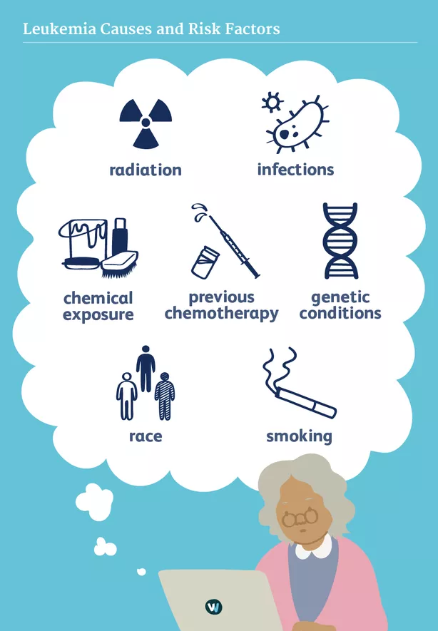

    Bisher sind die Ursachen für die Erkrankung an ALL weitgehend
unbekannt. Jedoch kann es vor allem durch Mutationen (genetische
Veränderungen) in einer lymphatischen Zelle zu einer bösartigen
Veränderung dieser Zelle kommen. Die Vermehrung dieser Zelle und der
Nachkommen geschieht dann unkontrolliert. Zudem gibt es Risikofaktoren,
welche diskutiert werden. Darunter zählen die radioaktive Strahlung,
bestimmte chemische Substanzen, das Rauchen, Virusinfektionen oder
Schwächungen des Immunsystems      

