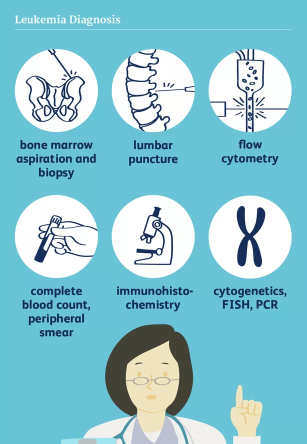

    Für die Erstellung einer Diagnose ist eine Untersuchung des
Knochenmarks essenziell. Grund hierfür ist, dass noch keine
feststellbare Ausschwemmung von Leukämiezellen aus dem Knochenmark im
Blut vorliegt. Die Diagnose einer ALL kann durch den Nachweis eines
Anteils lymphatischer Blasten von mindestens 20% im Knochenmark, der
Zuordnung der Blasten zur lymphatischen Reihe durch
Immunphänotypisierung und dem Nachweis charakteristischer genetischer
Veränderungen gestellt werden.      

