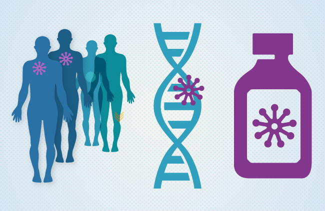

    Unbehandelt können Patienten binnen weniger Wochen an ALL
sterben. Heutzutage liegt die Heilungsrate nach intensiver Therapie bei
40 bis 50% bei Erwachsenen, bei Kindern bei 80%. Häufige Therapiearten
sind die systemische Chemptherapie, Tyrosinkinase-Inhibitor,
prophylaktische ZNS-Chemotherapie und ZNS-Bestrahlung.      

